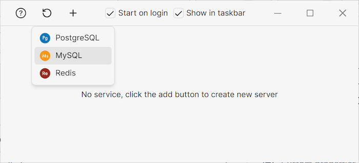
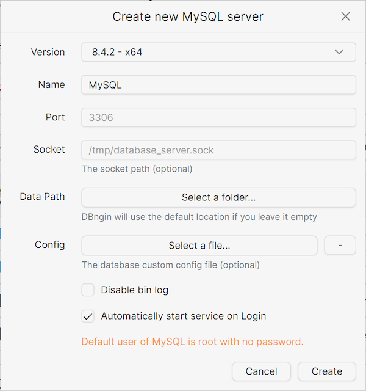
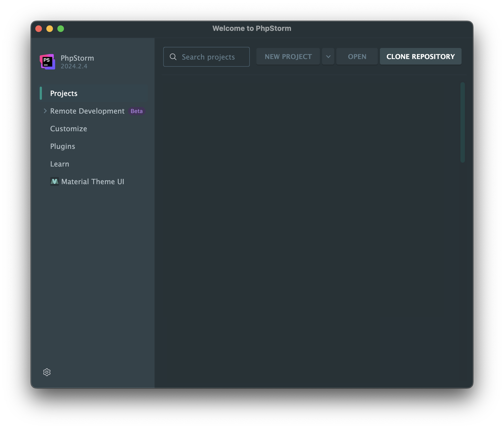

    Installatiestappen webserver en IDE

# Inhoud 

- [Download](#Download)
- [Jetbrains Account](#jetbrains-account)
- [Installatie](#installatie)
  - [GIT](#git)
  - [Jetbrains Toolbox](#jetbrains-toolbox)
  - [Laravel Herd](#installatie-laravel-herd)
    - [Configuratie Herd](#configuratie-herd)
  - [PHPStorm](#phpstorm)
  - [DBngin](#dbngin)
    - [Database toevoegen](#database-toevoegen)
    - [PHPMyAdmin toevoegen](#phpmyadmin-toevoegen)
- [PHP Projecten](#php-projecten)
  - [Lesopdrachten](#lesopdrachten)
  - [Werkmap](#werkmap)
  - [Eindopdracht](#eindopdracht)
- [[OPTIONEEL] GitHub Student Developer Pack](#OPTIONEEL-github-student-developer-pack)
  - [Domeinnaam](#domeinnaam)
  - [Cloud Hosting](#cloud-hosting)

--------------------

# Download

Download de volgende pakketten maar installeer deze nog **NIET**. De installatie volgt stap voor stap in deze
handleiding.

- Download [Laravel Herd](https://herd.laravel.com/) (de Pro versie is niet nodig)
- Download en installeer de [Jetbrains Toolbox](https://www.jetbrains.com/toolbox-app/)
- Download [DBngin](https://dbngin.com/)
- Download [GIT](https://git-scm.com/downloads)

--------------------

# Jetbrains Account

Jetbrains biedt studenten de mogelijkheid, zolang je studeert, om gratis gebruik te maken 
van hun software. Hiervoor moet je een account aanmaken op de 
[Jetbrains website](https://www.jetbrains.com/shop/eform/students). Gebruik hiervoor je e-mailadres
van de Hogeschool Rotterdam.

--------------------

# Installatie

## GIT

### Mac
- De meeste Macs hebben GIT al geïnstalleerd. Open Terminal en typ `git --version`.
  Als je een versienummer ziet, is GIT al geïnstalleerd en kan je deze stap overslaan.
  Zo niet, dan kun je GIT installeren via de [GIT website](https://git-scm.com/download/mac). Ik zou de Homebrew optie
  aanraden. Dit zal je op de Mac later ook nog nodig hebben.

### Windows
- Dubbelklik de installer en volg de stappen. Laat alle settings staan zoals ze staan behalve:
- Bij **select components** vink je de optie _Add a Git Bash Profile to Windows Terminal_
  
- Bij het scherm **Adjusting the name of the initial branch in new repositories** kies je voor _main_
  

## Jetbrains Toolbox

- Dubbelklik de installer en volg de stappen.
- Als de Jetbrains Toolbox helemaal geïnstalleerd is, kun je inloggen met je Jetbrains account.
  Open de toolbox en klik op het icoontje rechtsboven in de hoek en klik op _Log in_.

  

  Via de browser kun je nu inloggen met het Jetbrains Account dat je zojuist hebt aangemaakt.

## Installatie Laravel Herd

- Start en doorloop de installer van [Laravel Herd](https://herd.laravel.com/).
- [MAC] Geef permissie voor nginx en dnsmasq. 
  
- Als laatste stap heb je de mogelijkheid om de installatie te voltooien. 
- [WINDOWS] Vink de twee opties aan
  - _Automatically launch Herd on system startup_
  - _Launch Herd minimized as system tray application_
    
- [MAC] Vink de optie aan.
  - _Launch Herd on system startup_
    
- Start de Laravel Herd applicatie.
- [WINDOWS] Open Herd dashboard
  - In je system system tray (rechtsonderin) zie je een icoon van Herd. Klik hierop.
  - Hiermee open je het Herd dashboard.
    
- [MAC] Open Herd Menu
  - Open het Herd menu via het icoon in de Menu Bar (rechtsboven).
    

## Configuratie Herd

### Add trailing slash

Om ervoor te zorgen dat de URL's in de browser altijd eindigen met een `/` kun je dit instellen in Herd.

- Klik op het rechtermuisklik op het Herd icoon in de system tray (Windows) of manu bar (Mac).
- Kies voor **configuration files**.
- Dit opent `.config/herd` 
- Ga nu naar `config/nginx` en open herd.conf in een teksteditor.
- Boven het onderdeel location voeg je de volgende regel toe.
  ```apacheconf
  rewrite ^([^.]*[^/])$ $1/ permanent;
  ```
- Nu ziet je config er als volgt uit:
  ```apacheconf
    server {
    listen 127.0.0.1:80 default_server;
    #listen VALET_LOOPBACK:80; # valet loopback
    root /;
    charset utf-8;
    client_max_body_size 128M;

    rewrite ^([^.]*[^/])$ $1/ permanent;
  
    location ~* /41c270e4-5535-4daa-b23e-c269744c2f45/([A-Z]+:)(.*) {
        internal;
        alias $1;
        try_files $2 $2/;
    }
   ```
- Sla het bestand op en sluit het.
- Wederom rechtermuisklik op het Herd icoon in de system tray (Windows) of manu bar (Mac) en kies voor 
  **Stop all services** en vervolgens **Start all services**.

### Development folder toevoegen

In deze stap ga je een folder aanmaken waar alle PHP-projecten in komen te staan. Deze folder ga je toevoegen aan Herd. 

_Hiervoor kies je een locatie op je harde schijf welke **buiten** je OneDrive of Google Drive map ligt. Dit is belangrijk 
omdat deze mappen synchroniseren met de cloud wat vervelend kan zijn als het om veel bestanden gaat. Ook kan het
problemen geven met de rechten van de bestanden. Om toch een backup te hebben van de projecten is het verstandig deze 
toe te voegen aan GIT en te uploaden naar GitHub._ 


- Kies nu een locatie op je harde schijf welke buiten je OneDrive of Google Drive map ligt.
- Maak de Development folder aan.  
  - [WINDOWS] `C:\Users\[USER ACCOUNT]\Development`.
  - [MAC] `~/Development` of `Users/[USER ACCOUNT]/Development`. 
- Voeg de folder als **Path** toe aan Herd
  - [WINDOWS] Open het Dashboard en klik op General. Klik op Add Path en selecteer de map `Development`.
    
  - [MAC] Open het Herd menu en klik op Settings. Onder de tab **General** zie je **Herd Paths** staan. Klik op het 
    `+`-teken en selecteer de map `Development`.
    

### Directory listing aanzetten

Wanneer je in je browser de URL behorende bij de site / project opent, zie je een 404-foutmelding. Er staat immers
nog geen bestanden in de map. Ook als er (PHP)-bestanden in de map staan (behalve index.php of index.html), zal
je deze niet zien. Vanwege veiligheidsoverwegingen staat **directory listing** standaard uit. Om makkelijk naar
bestanden te kunnen navigeren zetten we deze in de ontwikkelomgeving aan.

- Open Powershell (Terminal op Mac).
- Voer het volgende commando in
  ```bash
  herd directory-listing on
  ```

## PhpStorm

- Open de Jetbrains Toolbox (System tray) en zoek naar PhpStorm.
- Klik op _Install_ en wacht tot de installatie is voltooid.
- Open PhpStorm vanuit de toolbox.
- Geef toestemming voor netwerken.
- Je kunt Jetbrains eventueel helpen door anonieme statistieken te delen.

Om te testen of de server werkt hun je de map openen waarin je je PHP-bestanden gaat plaatsen en 
daarin een nieuw PHP-bestand maken. 
- Klik op _Open_ en open de 'Development' map. (Bijvoorbeeld `C:\Users\[USER ACCOUNT]\Development`)
- Kies voor _Trust Project_
- Aan de linkerkant zie je een icoontje van een folder om de folderstructuur te zien. Klik hierop als deze nog niet
zichtbaar is. 
- Rechtermuisklik op de hoofdmap en kies voor _New > Directory_
  - Geef de map de naam _serverinfo_
- Rechtermuisklik op de map _serverinfo_ en kies voor _New > PHP File_
- Geef het bestand de naam `phpinfo.php`
- Typ in dit bestand 
  ```php
  <?php 
  phpinfo();
  ```
Je kunt het resultaat testen door de pagina in de browser te openen. 
- Klik met de rechtermuisknop op **Herd** in de system tray en kies voor _Open Sites_.
- Bij de settings van de site 'Development' kun je op het url klikken. In de toekomst kun je direct `development.test` 
intikken in de browser.
- Klik op de link `serverinfo` en vervolgens op `phpinfo.php` en je ziet nu een pagina met alle PHP-instellingen.

⚠️ Wanneer je het bestand (`phpinfo.php`) gebruikt op een live-server om informatie over de server te krijgen, is het verstandig om 
het bestand, na het inzien van de informatie, direct te verwijderen. Het geeft namelijk veel informatie over de server en kan een
veiligheidsrisico vormen.

🎉 Gefeliciteerd! Je hebt nu een werkende webserver en IDE.

## DBngin

- Dubbelklik de installer en volg de stappen. Laat de standaard opties staan. 
- Na het starten van de applicatie vink je bovenin de twee opties aan: 
  - _Start on login_
  - _Show in taskbar_

### Database toevoegen

Als eerste gaan we een nieuwe MySQL server toevoegen, om vervolgens een database aan te kunnen maken.
- Klik op het `+`-teken om een database toe te voegen. En kies voor MySQL.

- In het volgende overzicht pas je de volgende dingen aan.
  - Name: MySQL
  - vinkje voor _Automatically start service on Login_.
  
  let op! Zoals aangegeven in de afbeelding (oranje letters), zijn de default credentials om te verbinden met de server:
    - **Username**: root
    - **Password**: _leeg laten_

- Klik op _Create_ en vervolgens op _OK_ om een admin toe te voegen.
- Geef toestemming voor de toegang tot netwerken.

### PHPMyAdmin toevoegen

Om makkelijk bij een database te kunnen om bijvoorbeeld een nieuwe database aan te maken, de inhoud van een tabel te 
kunnen zien of om data te bewerken (admin taak) kun je gebruik maken van een database management tool. Deze bestaan in 
desktop variant, het zit ook ingebouwd in PHPStorm, maar een veelgebruikte variant is via een Webomgeving. PHPMyAdmin
is een veel gebruikte toepassing. Om PHPMyAdmin te kunnen gebruiken doe je het volgende.  

- Download [PHPMyAdmin](https://www.phpmyadmin.net/downloads/). Je kunt de ZIP-file van de Engelse versie downloaden.
- Bij de installatie van Herd werd er standaard een Herd map aangemaakt op je harde schijf. Open deze map.
  ```bash
    C:\Users\[USER ACCOUNT]\Herd
  ```
- Maak een nieuwe map aan in de Herd map en noem deze `phpmyadmin`.
- Pak de ZIP-file uit en plaats de inhoud naar de map `phpmyadmin`.
- In de map `phpmyadmin` staat een bestand `config.sample.inc.php`. Hernoem dit bestand naar `config.inc.php`.
- Open het bestand in een teksteditor en zoek naar de regel `$cfg[‘Servers’][$i][‘AllowNoPassword’]`. 
  Verander de waarde van `false` naar `true`.
  ```php
  $cfg['Servers'][$i]['AllowNoPassword'] = true;
  ```
- Sla het bestand op en sluit het.
- Via de browser kun je nu PHPMyAdmin openen door naar `phpmyadmin.test` te gaan. Of via de Sites in Herd.

PHPMyAdmin gebruiken wij als voorbeeld in de lessen en de kennisclips. Heb je wat meer ervaring dan kun je ook 
via `http://database.herd.test` de database benaderen.

--------------------
  
# PHP Projecten

In de **Development** map gaan we drie projecten maken. Het eerste project komt van GitHub en dat is het project met 
alle **lesopdrachten** en voorbeelden. Het tweede project is de **werkmap** waarin je alle lesopdrachten
uitwerkt. Het laatste project is het project met de **eindopdracht**. Hierin komt de website te staan die je deze cursus 
gaat maken en die je aan het einde van de cursus inlevert als eindopdracht.

## Lesopdrachten

- Ga naar de [GitHubpagina](https://GitHub.com/HR-CMGT) van CMGT en dan specifiek de [repository 
  van Programmeren 2](https://GitHub.com/HR-CMGT/PRG02-2024-2025)
- Hier zie je een groene knop met de tekst **Code**. Klik hierop en kopieer de `https` link die je ziet staan.
- Ga nu naar PHPStorm en kies voor _Get from VCS_.
  
- Plak de link van GitHub bij url en bij Directory navigeer je naar de **Development** map.
- Achter **Development** geef je de map de naam `prg02-lesopdrachten` en klik je op _Clone_.
  
- Login met Github via de browser
- De inhoud van de mappen is ook te zien in de browser via de link `development.test` en klik op **prg02-lesopdrachten**

## Werkmap

- Maak een nieuwe map aan in de **Development** map en noem deze `prg02-werkmap`
- Wanneer je aan de lesopdrachten gaat werken, kopieer je de folder van de les naar deze map. 
  Zo kun je de lesopdrachten uitwerken zonder dat je de originele lesopdrachten aanpast.

## Eindopdracht

- Ga in PhpStorm naar _File > New Project_
- Kies voor empty PHP Project. 
- Geef de folder de naam `prg02-eindopdracht`.
- En plaats deze in de **Development** folder.
  
- Klik op Create en je ziet nu een lege map met de naam eindopdracht.

**Toevoegen aan GitHub**

Om ervoor te zorgen dat jouw project veilig is opgeslagen, voeg je deze toe aan GitHub. 

- Als het project open staat, klik je op _VCS > Share Project on GitHub_
- Eventueel moet je hierna inloggen met je GitHub account.
- Klik op Share en je project wordt geüpload naar GitHub.

## [OPTIONEEL] GitHub Student Developer Pack

Als onderdeel van de GitHub Student Pack heb je toegang tot allerlei gratis diensten, waaronder een gratis
account op GitHub Pro. Hiermee kun je onbeperkt private repositories aanmaken. $200 aan gratis tegoed op
Digital Ocean voor cloud hosting, een jaar lang gratis domeinnaam registratie op Namecheap en nog veel meer.

- Om toegang te krijgen tot deze diensten, ga je naar [https://education.GitHub.com/pack](https://education.GitHub.com/pack)
- Klik op _Get student benefits_
- Kies voor _Student_
- En gebruik het e-mailadres van de Hogeschool Rotterdam als je het account aanmaakt.

### Domeinnaam

Via the student pack kan je bij namecheap een domeinnaam (.me) registreren.
 - bezoek https://nc.me/GitHub/auth
 - login met je GitHub account behorende bij het student pack (e-mailadres van de Hogeschool Rotterdam)
 - Geef namecheap toegang tot je GitHub account
 - Kies een domeinnaam en registreer deze
 - Je hebt nu een domeinnaam die je kunt gebruiken voor je eindopdracht en deze kun je beheren in het [dashboard](https://ap.www.namecheap.com/).
 - Klik op Domain List > Domain > Redirect domain. 
 - bij Source url vul je je domeinnaam in (zonder http://) en bij Destination URL vul je het adres van je eindopdracht in.

### Cloud Hosting

Nadat je je hebt aangemeld voor het Student Developer Pack, kun je een gratis account aanmaken op Digital Ocean.

- Ga naar [https://www.digitalocean.com/github-students](https://www.digitalocean.com/github-students)
- Klik op _Redeem your DigitalOcean credit_
- Log in met je Github account (gebruik de knop _Sign up with Github_)
- _Authenticate with GitHub_ en geef Digital Ocean toegang om je e-mailadres uit te lezen.
- Je hebt nu je eigen cloud hosting account.
- Deze kun je bezoeken via [https://cloud.digitalocean.com](https://cloud.digitalocean.com)
