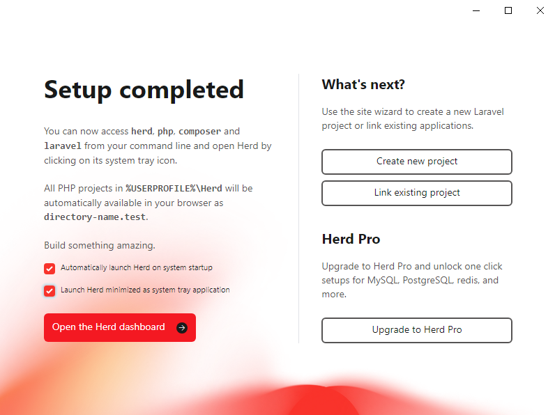

## Installatie Laravel Herd

- Download de laatste versie van [Laravel Herd](https://herd.laravel.com/).
- Installeer Herd. 
- Als laatste stap heb je de mogelijkheid om de installatie te voltooien. Vink de twee opties aan
  - _Automatically launch Herd on system startup_
  - _Launch Herd minimized as system tray application_

- Start de Laravel Herd applicatie.
- In je system system tray (Windows rechtsonderin) zie je een icoon van Herd. Klik hierop.
- Hiermee open je het Herd dashboard.


## Configuratie

### Development folder toevoegen

- In het Dashboard zie je aan de rechterkant een kop met **Quick Access** en daaronder de knop
**Open Sites**. Klik hierop.
- Klik op de knop **Add Site**.
- Kies de optie **Link existing project**.
- Kies nu een locatie op je harde schijf welke buiten je OneDrive of Google Drive map ligt. 
  Dit is belangrijk omdat deze mappen vaak synchroniseren en dat kan problemen geven met de 
  bestanden van je project of de rechten van de bestanden.
- Maak de folder aan en selecteer deze. Wij hebben gekozen voor de map `C:\Users\[USER ACCOUNT]\Development`.
- De settings in het volgende scherm kun je aanpassen naar de laatste versie van PHP, maar 
waarschijnlijk staat dit al goed. **HTTPS** hoef je niet aan te vinken.
- Geef toestemming voor **Windows Powershell**

### Directory listing aanzetten

Wanneer je in je browser de URL behorende bij de site / project opent, zie je een 404-foutmelding. Er staat immers
nog geen bestanden in de map. Ook als er (PHP)-bestanden in de map staan (behalve index.php of index.html), zal 
je deze niet zien. Vanwege veiligheidsoverwegingen staat **directory listing** standaard uit. Om makkelijk naar 
bestanden te kunnen navigeren zetten we deze in de ontwikkelomgeving aan.

- Open Powershell (Terminal op Mac).
- Voer het volgende commando in
  ```bash
  herd directory-listing on
  ```